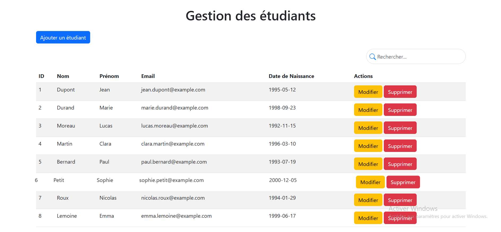

# Student Management

**Student Management** is a simple web application for managing student information. It includes CRUD (Create, Read, Update, Delete) functionalities and allows searching for students in the database. The project also integrates an AI feature for analyzing student data.

## Screenshot

Here is a screenshot of the application interface:



## Features

- **Student CRUD:**
  - Add a student
  - Display students
  - Edit student information
  - Delete a student

- **Student Search:**
  - Search for students by name, first name, or email in real time.

- **AI Task:**
  - Study Domain Prediction Based on First Name

## Technologies Used

- **Frontend:**
  - HTML
  - CSS (Bootstrap)
  - JavaScript (jQuery)

- **Backend:**
  - PHP
  - MySQL

- **Database:**
  - MySQL

- **Development Tools:**
  - XAMPP (Apache, PHP, MySQL)
  - Visual Studio Code (code editor)

## Installation

### Steps to run the project locally:

1. **Download and install XAMPP:**
   - Download XAMPP from [here](https://www.apachefriends.org/index.html).
   - Install and start Apache and MySQL using the XAMPP control panel.

2. **Clone the project:**
   - Clone this repository to your local machine:
     ```bash
     git clone https://github.com/YathrebSamaali/Student-CRUD.git
     ```

3. **Configure the database:**
   - Open **phpMyAdmin** via `localhost/phpmyadmin` in your browser.
   - Create a new database called `student_management`.
   - Run the following SQL script to create the students table:
     ```sql
     CREATE TABLE students (
         id INT AUTO_INCREMENT PRIMARY KEY,
         nom VARCHAR(100) NOT NULL,
         prenom VARCHAR(100) NOT NULL,
         email VARCHAR(100) NOT NULL,
         date_naissance DATE NOT NULL
     );
     ```

4. **Configure the database connection:**
   - In the `connect.php` file, make sure the database connection parameters are correct (default: `localhost`, `root`, and no password).

5. **Start the project:**
   - Move the project folder to the `htdocs` directory of your XAMPP installation (default: `C:\xampp\htdocs\`).
   - Open `http://localhost/Student-CRUD` in your browser to access the application.

## Author

- **Yathreb Samaali** - [GitHub](https://github.com/YathrebSamaali)
